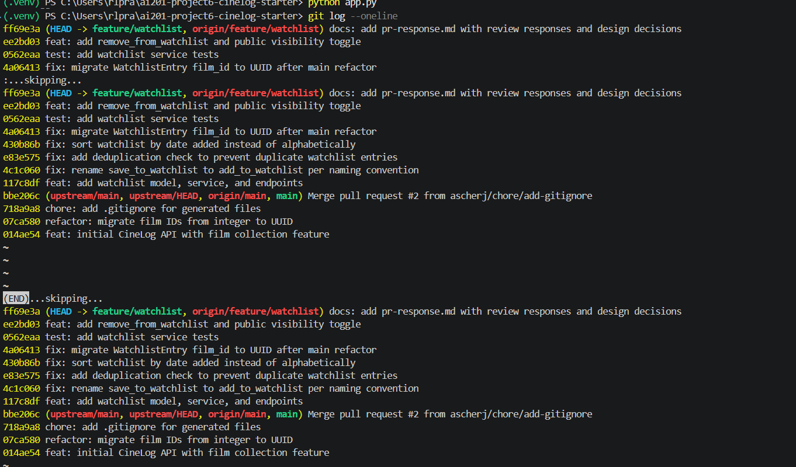

# PR Response Doc — CineLog Watchlist Feature

This document responds to @dev-lead's six review comments on the watchlist PR.
For each comment it records what changed and the reasoning, and for the two
design comments (4 and 5) it lays out the argument and the tradeoff.

Reviewer's comments, mapped to the sections below:

| # | Where | Ask | Type |
|---|-------|-----|------|
| 1 | inline, `watchlist_service.py` | rename `save_to_watchlist` → `add_to_watchlist` | code |
| 2 | inline, `watchlist_service.py` | handle duplicate adds | code |
| 3 | conversation | add a test for a nonexistent `film_id` | code |
| 4 | conversation | justify the `public=True` default | design |
| 5 | inline, `watchlist_service.py` | prefer date-added over alphabetical sort | design |
| 6 | conversation | rebase on main; watchlist still uses integer IDs | rebase |

---

## AI Usage

- **Orientation.** I used an AI assistant to summarize `models.py`,
  `services/collection_service.py`, and `tests/test_collection.py` before
  reading the review, then verified each summary against the code. The one
  thing worth flagging: I confirmed by reading the code (not trusting the
  summary) that `add_to_collection()` deduplicates with
  `CollectionEntry.query.filter_by(user_id=..., film_id=...).first()` and
  raises `AlreadyInCollectionError` — which is the exact pattern I mirrored
  for Comment 2.
- **Stress-testing the design arguments (Comments 4 and 5).** After drafting
  my positions I asked the assistant to argue the *opposite* side — "what
  would a careful reviewer say against this?" For Comment 4 it raised
  privacy-by-default / principle-of-least-surprise, which I had only weakly
  addressed; I revised to add the explicit `public` parameter and to name the
  specific condition (user-research evidence of privacy expectations) under
  which I would flip the default. For Comment 5 the counterargument was
  "alphabetical is better for "is film X already on my list?" lookups" — I
  kept my position but added that dedup (409) already guards accidental
  re-adds, so lookup is a weaker need than recency.
- **Commit hygiene.** I used AI to sanity-check that each commit subject
  follows Conventional Commits and represents one logical change, then checked
  the final `git log` against `CONTRIBUTING.md` myself.
- What AI did **not** do: it did not choose my positions on Comments 4 and 5.
  The sort/consistency argument (matching `get_collection`) and the
  community-discovery argument (CineLog's stated purpose) are my own, grounded
  in this repo.

---

## Comment 1 — Rename `save_to_watchlist` → `add_to_watchlist`

**What I did:**
Renamed the service function to `add_to_watchlist()` in
`services/watchlist_service.py` and updated its one call site in
`routes/watchlist/watchlist.py` (both the `import` and the call inside
`add_film`).

**Where I looked to find all call sites:**
I ran a project-wide search for `save_to_watchlist` (ripgrep, excluding
`.venv`) and confirmed only the service definition and the route import/call
matched. After the change, the same search returns zero matches.

**Why:**
`CONTRIBUTING.md` documents a `verb_to_noun` service-naming convention and the
sibling module already uses `add_to_collection()` / `remove_from_collection()`
/ `get_collection()`. `add_to_watchlist` makes the watchlist API read
identically to the collection API.

**How I verified:** `rg save_to_watchlist` → no matches; app imports cleanly;
full test suite green.

---

## Comment 2 — Deduplication

**What I did:**
Added an `AlreadyInWatchlistError` exception and a duplicate check to
`add_to_watchlist()`, following `add_to_collection()` exactly: after the film
exists, query `WatchlistEntry.query.filter_by(user_id=user_id,
film_id=film_id).first()` and raise if an entry already exists — before
creating a new row. I also taught the `POST /watchlist/<user_id>/add`
endpoint to translate the exceptions to HTTP status codes, mirroring the
collection route: `409` on `AlreadyInWatchlistError`, `404` on
`FilmNotFoundError`.

**How I verified the logic works:**
`test_add_to_watchlist_duplicate_raises` adds the same film twice, asserts
`AlreadyInWatchlistError` is raised on the second call, and asserts exactly
one row exists. End-to-end, a duplicate `POST` returns `409`.

**Why this pattern:** the collection service is the established precedent, and
reusing its shape (same exception style, same query) keeps the two services
consistent and reviewable.

---

## Comment 3 — Missing test (nonexistent `film_id`)

**What I did:**
Created `tests/test_watchlist.py`, copying the fixture structure from
`tests/test_collection.py` (`app`, `sample_user`, `sample_film`). The
required test, `test_add_to_watchlist_nonexistent_film_raises`, is the direct
equivalent of `test_add_to_collection_nonexistent_film_raises`: it calls
`add_to_watchlist` with a UUID that isn't in the DB
(`"00000000-0000-0000-0000-000000000000"`) and asserts `FilmNotFoundError`.

**Which test I modeled it on:** `test_add_to_collection_nonexistent_film_raises`
— same fake-UUID approach and same `pytest.raises` assertion.

**Additional tests (also in the file):** `CONTRIBUTING.md` asks for happy
path + duplicate + nonexistent for any new service function, so I also added
the happy-path and duplicate tests, plus `test_get_watchlist_returns_newest_first`
to lock in the Comment 5 sort decision. (See Stretch section for the second
self-chosen edge case.)

**How I verified:** `pytest tests/test_watchlist.py -v` — all pass;
`pytest tests/ -v` — 11 passed.

---

## Comment 4 — Default visibility (`public=True`)

**My position:** Keep `public=True` as the default — but make it an
*intentional, documented, and overridable* default rather than an inherited
one. I added an explicit `public` parameter to `add_to_watchlist()` (and to
the add endpoint) so callers can set visibility per entry.

**Reasoning (specific to CineLog):**
- CineLog is described in this very PR as a **community film tracking app**,
  and it already ships two social-facing surfaces (a shared film catalog with
  `average_rating`, and collections). The product's value is discovery — users
  learning what others are into. A watchlist is a *forward-looking* signal
  ("films I intend to watch"), which is exactly the low-stakes, high-signal
  data that powers "people planning to watch X" style discovery. Defaulting
  watchlists private would switch off that feature for the majority of users
  who never touch a settings toggle, undercutting the platform's core loop at
  launch.
- A watchlist is also *less* sensitive than the collection: the collection
  records what you actually watched **and your 1–5 rating** (an opinion),
  whereas a watchlist is just intent. If any list should be public by default,
  it's the lower-sensitivity one.
- The reviewer's real ask was intentionality — "not just inheriting a
  default." I address that directly: I'm choosing public because of the
  discovery mission, and I made the choice *explicit in the API* via the new
  `public` param so no future caller has to rely on an implicit default.

**Tradeoff acknowledged:** Public-by-default violates privacy-by-default and
the principle of least surprise. Some users treat a watchlist as private
planning and would be surprised it's visible; there's a genuine risk of
unintended exposure (e.g. someone watchlisting sensitive-topic documentaries).
Mitigations I shipped / recommend: (1) the new `public` parameter makes
"private" a first-class, per-entry choice, not a workaround; (2) as follow-up,
the UI should show each entry's visibility plainly and offer an account-level
default. **I would flip the default to private** if user research showed that
CineLog users predominantly expect watchlists to be private — absent that
evidence, the community-discovery mission wins.

---

## Comment 5 — Sort order

**My position:** I agree with the maintainer — sort by **date added, newest
first**. Implemented in `get_watchlist()` as
`.order_by(WatchlistEntry.date_added.desc())` (replacing
`Film.title.asc()`).

**Reasoning (specific to CineLog):**
- **Consistency with the existing codebase.** `get_collection()` already sorts
  `CollectionEntry.date_added.desc()` and its docstring says "newest first."
  Collection and watchlist are sibling features; making the watchlist sort the
  same way means one mental model and one UI ordering across both. Alphabetical
  would make the watchlist the lone exception.
- **Semantics of a watchlist.** It's a queue of intent — "what should I watch
  next." Recency correlates with relevance: the film you added last night
  because a friend recommended it is the one you're most likely to act on.
  Alphabetical ordering is relevance-blind and permanently buries titles late
  in the alphabet.
- **Feedback at scale.** As a list grows, `date_added desc` always surfaces the
  film you just added at the top — immediate "it worked" confirmation. Under
  alphabetical, a new add scatters to an arbitrary position and the user can't
  easily see it landed.

**Engagement with the reviewer's point:** The maintainer said "most users want
to see what they added recently," and I think that's right; I'd add that the
stronger structural reason is consistency with `get_collection`, which already
made this exact decision.

**Tradeoff acknowledged:** Alphabetical genuinely wins for one task — scanning
"is film X already on my list?" I judged that a weaker need than recency for
two reasons: dedup now blocks accidental re-adds (a duplicate `POST` returns
`409`, so users don't rely on scanning to avoid dupes), and a lookup can be
served later by an optional `?sort=title` parameter without changing the
default. `test_get_watchlist_returns_newest_first` locks the behavior in.

---

## Comment 6 — Rebase

**What conflicted:**
`main` had merged `refactor: migrate film IDs from integer to UUID`, which
rewrote `models.py` so `Film.id` and `CollectionEntry.film_id` became
`db.String(36)` UUIDs. My branch still defined `WatchlistEntry.film_id` as
`db.Integer`, and the watchlist service/route/tests assumed integer film IDs.
When I ran `git rebase origin/main`, because the refactor had rewritten nearly
every line of `models.py`, the 3-way merge resolved that file in main's favor
and **silently dropped my appended `WatchlistEntry` class** — leaving
`watchlist_service.py` importing a model that no longer existed (`ImportError`
when the app started).

**How I resolved it:**
I rebased the feature onto the current `main` and re-integrated the watchlist
model on top of the UUID base, then changed `WatchlistEntry.film_id` to
`db.String(36)` with `ForeignKey("film.id")` so the foreign key matches the
migrated `Film.id`. I also updated the now-wrong integer docstrings in the
service and route, and used a UUID-string fake id in the nonexistent-film
test. The result is a linear branch on top of `main` with **no merge
commits**. (This is the `fix: migrate WatchlistEntry film_id to UUID after
main refactor` commit.)

**How I verified no conflict remains:**
- `git log --oneline upstream/main..HEAD` shows a linear history; `git log
  --merges upstream/main..HEAD` is empty (no merge commits).
- `git merge-base --is-ancestor upstream/main HEAD` succeeds — the branch sits
  directly on top of main.
- `pytest tests/ -v` → 11 passed, including tests that create and query
  `WatchlistEntry` rows by UUID.
- End-to-end HTTP smoke test (add / duplicate / unknown-film / list-order /
  remove) all returned the expected status codes.

---

## Stretch Features

**`remove_from_watchlist(user_id, film_id)`** — implemented following the
`remove_from_collection` pattern: look up the entry, raise
`NotInWatchlistError` if absent, otherwise delete and return `True`. Exposed as
`DELETE /watchlist/<user_id>/remove` (returns `200`, or `404` if the film
isn't on the list). Tested by `test_remove_from_watchlist_deletes_entry` and
`test_remove_from_watchlist_not_present_raises`.

**Second self-chosen test** — `test_add_to_watchlist_respects_public_flag`.
I chose the visibility edge case because Comment 4 turns `public` into a
meaningful, user-visible behavior; a default that silently ignored an explicit
`public=False` would be a privacy bug. The test asserts that passing
`public=False` persists a private entry. (The duplicate and newest-first tests
are additional coverage beyond the required nonexistent-film test.)

**Visibility toggle on the endpoint** — `add_to_watchlist()` takes an explicit
`public=True` parameter and the add endpoint reads `"public"` from the request
body (`data.get("public", True)`), so callers set visibility explicitly instead
of relying on the model default. This is also the mitigation referenced in
Comment 4.

---

## PR Description

### What the watchlist feature does
Lets a CineLog user save films they intend to watch (distinct from the
collection, which is films they've already watched and rated). It adds a
`WatchlistEntry` model, `add_to_watchlist` / `remove_from_watchlist` /
`get_watchlist` service functions, and REST endpoints under `/watchlist`.
Duplicate adds are rejected, and each entry carries a `public` visibility flag.

### Endpoints
- `GET /watchlist/<user_id>` — list a user's watchlist, newest-added first.
- `POST /watchlist/<user_id>/add` — body `{ "film_id": "<uuid>", "public": true }`
  (`public` optional, defaults to `true`). `201` on success, `409` if already
  on the list, `404` if the film doesn't exist, `400` if `film_id` is missing.
- `DELETE /watchlist/<user_id>/remove` — body `{ "film_id": "<uuid>" }`.
  `200` on success, `404` if not on the list.

### Design decisions
- **Default visibility = public** (Comment 4). Intentional, to serve CineLog's
  community-discovery purpose; made overridable via an explicit `public`
  parameter. Tradeoff: weaker privacy-by-default, mitigated by the per-entry
  override. Would revisit given user-research evidence.
- **Sort order = date added, newest first** (Comment 5). Chosen for
  consistency with `get_collection()` and because a watchlist is a
  recency-driven queue. Tradeoff: alphabetical lookup is better served later
  by an optional sort parameter.

### How to manually test
```bash
python -m venv .venv && source .venv/Scripts/activate   # Windows Git Bash
pip install -r requirements.txt
pytest tests/ -v          # 11 passing

python app.py             # serves http://127.0.0.1:5000 (no frontend; 404 at / is expected)
```
Then, using a real user id and film id from your DB (create them via the
existing `films` endpoints, or in a `flask shell`):
```bash
# add a film to the watchlist
curl -X POST http://127.0.0.1:5000/watchlist/<user_id>/add \
     -H "Content-Type: application/json" -d '{"film_id": "<uuid>"}'          # 201

# adding the same film again is rejected
curl -X POST http://127.0.0.1:5000/watchlist/<user_id>/add \
     -H "Content-Type: application/json" -d '{"film_id": "<uuid>"}'          # 409

# add a private entry
curl -X POST http://127.0.0.1:5000/watchlist/<user_id>/add \
     -H "Content-Type: application/json" -d '{"film_id": "<uuid2>", "public": false}'  # 201, public=false

# list (newest added first)
curl http://127.0.0.1:5000/watchlist/<user_id>

# remove
curl -X DELETE http://127.0.0.1:5000/watchlist/<user_id>/remove \
     -H "Content-Type: application/json" -d '{"film_id": "<uuid>"}'         # 200
```

---

## Commit History

Rebased on `main`, linear, no merge commits (Conventional Commits per
`CONTRIBUTING.md`):

```
docs: add pr-response.md with review responses and design decisions
feat: add remove_from_watchlist and public visibility toggle
test: add watchlist service tests
fix: migrate WatchlistEntry film_id to UUID after main refactor
fix: sort watchlist by date added instead of alphabetically
fix: add deduplication check to prevent duplicate watchlist entries
fix: rename save_to_watchlist to add_to_watchlist per naming convention
feat: add watchlist model, service, and endpoints
```

(Order above is newest-first, as `git log --oneline` prints it; short hashes
omitted here since they change on any history edit — see the screenshot.)

> Screenshot: paste an image of `git log --oneline` here for submission.

